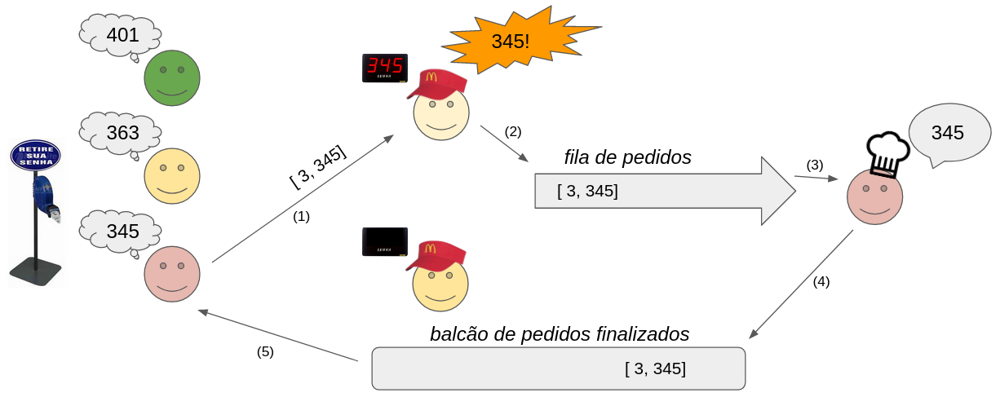

# INE5410 - Trabalho avaliado 1 - 2020/2
A melhor lancheria da ilha, o famoso "Dog do Odomar", está passando por reformas administrativas e contratuais, expandindo consideravelmente sua equipe de colaboradores. Devido ao grupo ainda inexperiente, você foi encarregado pela administração local a ajudar no fluxo de trabalho, desenvolvendo um sistema de controle de pedidos. Considerando a existência das entidades *clientes*, *atendentes* e *cozinheiro*, sua tarefa é assegurar que a mesma ordem de pedidos tomada por atendentes seja realizada pela cozinha.


## Comportamento



* **Clientes:**
	1. Ao entrar no estabelecimento, retira uma senha única (```get_unique_ticket()```) e a aguarda ser anunciada no *chamador de senhas*.
	2. Ao identificar sua senha no *chamador de senhas*, o cliente passa um tempo escolhendo os itens que vai pedir (```client_think_order()```), e então faz o pedido com o atendente que o chamou (```client_inform_order()```).
	3. O cliente aguarda até que seu pedido seja finalizado (```client_wait_order()```). Uma vez finalizado, retira seu pedido do *balcão de pedidos* e vai embora.

* **Atendentes:**
	1. Se está ocioso e há clientes no estabelecimento, chama por uma nova senha já retirada por clientes.
	2. Aguarda até que o cliente faça o pedido.
	3. Ao receber o pedido:
		- Anota-o por um tempo (```clerk_anotate_order()```);
		- Invoca ```anounce_clerk_order()``` para imprimir o pedido na tela;
		- Cria o pedido (```clerk_make_order()```), encaminhando-o para a *fila de pedidos*.
	4. Repete os passos anteriores até esgotar as senhas retiradas (ou seja, quando ```get_retrieved_ticket()``` retorna -1).

* **Cozinheiro (somente um!):**
	1. Recebe um pedido da *fila de pedidos*.
	2. Cozinha o prato por um tempo aleatório (```cooker_cook_time()```).
	3. Encaminha pedido para a *bancada de pedidos finalizados*.
	4. Invoca ```anounce_cooker_order()``` para imprimir o pedido na tela.
	5. Atualiza número de pedidos concluídos.
	6. Informa o cliente que seu pedido está pronto.
	7. Repete os passos anteriores até que o número de pedidos seja igual ao número de clientes.
	- **OBS:** O cozinheiro não espera até que o cliente retire seu pedido para continuar cozinhando!

## Entrada
* Número de clientes.
* Número de atendentes.
* Tempo máximo em seg. para o cliente pensar no que vai pedir.
* Tempo máximo em seg. para o atendente anotar o pedido.
* Tempo máximo em seg. para o cozinheiro fazer um pedido.


## Saída Esperada
Abaixo é ilustrada uma saída válida para uma execução com 10 clientes e 2 atendentes. Perceba que o importante não é seguir a ordem sequencial nos ids de pedidos, e sim assegurar que **a mesma ordem de pedidos** definida pelas atendentes seja respeitada pela cozinha.
```
./dog 10 2 1 1 3
ATDT --[1, 32]-------------->
ATDT --[0, 20]-------------->
<--------------[1, 32]-- COZN
<--------------[0, 20]-- COZN
ATDT --[2, 58]-------------->
<--------------[2, 58]-- COZN
ATDT --[3, 102]-------------->
<--------------[3, 102]-- COZN
ATDT --[4, 109]-------------->
ATDT --[5, 118]-------------->
<--------------[4, 109]-- COZN
ATDT --[6, 124]-------------->
<--------------[5, 118]-- COZN
ATDT --[7, 155]-------------->
<--------------[6, 124]-- COZN
<--------------[7, 155]-- COZN
ATDT --[8, 205]-------------->
<--------------[8, 205]-- COZN
ATDT --[9, 215]-------------->
<--------------[9, 215]-- COZN
```

**OBS:** Você pode utilizar ```printf```s adicionais durante o desenvolvimento, mas é importante que a saída da versão final se dê única e exclusivemente pelos métodos de ```anounce``` informados.


## Dicas
* **Atendentes-Cozinheiro** devem se comunicar através de uma fila, implemente da maneira como quiser!
* Começe com o entendimento da estrutura *TicketCaller* disponibilizada (ela é segura de ser executada concorrentemente?).
* Inicie pelo caso mais simples (n clientes, 1 atendente), e só depois considere o incremento no número de atendentes.


## Realização do Trabalho e Entrega
O trabalho deverá ser realizado **em duplas**. A escolha dos grupos, o desenvolvimento e a entrega do trabalho deverão ser feitos via Github Classroom. Um pequeno guia sobre o Github Classroom e o Git foi disponibilizado no Moodle. **Leia atentamente o guia antes de fazer a escolha dos grupos e começar a atividade**. **ATENÇÃO: Serão permitidos somente 25 grupos! Defina sua dupla conversando com seus colegas e, somente após a definição da dupla, crie um grupo no Github Classroom**.

Será considerado **entregue** a versão do repositório **criado via Github Classroom** com o último commit realizado até a data limite para submissão (**22 Novembro 23:59**). Na versão entregue deve constar além da implementação, um documento no formato pdf de no máximo 3 páginas respondendo as seguintes perguntas:

* Como foi a distribuição do trabalho realizado pela dupla?
* Quantas estruturas de sincronização no total foram utilizadas em sua solução? Descreva onde e porque foram utilizadas, utilize capturas de tela ou pseudo-códigos se julgar necessário.
* É possível resolver o problema em questão sem o uso de nenhum mecanismo de sincronização? Justifique o porquê.
